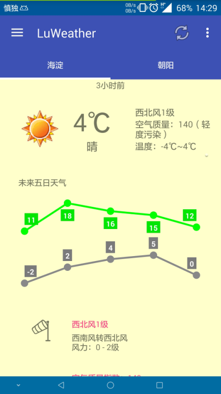
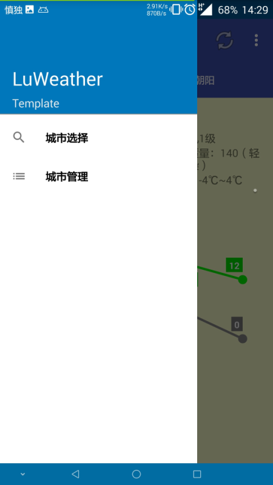
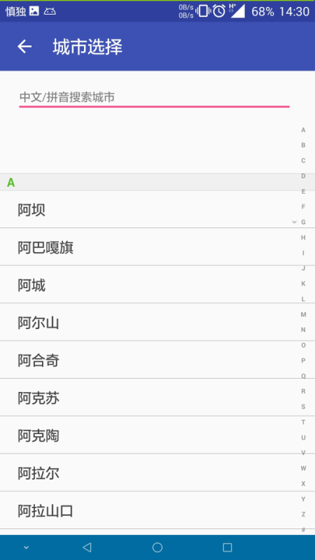
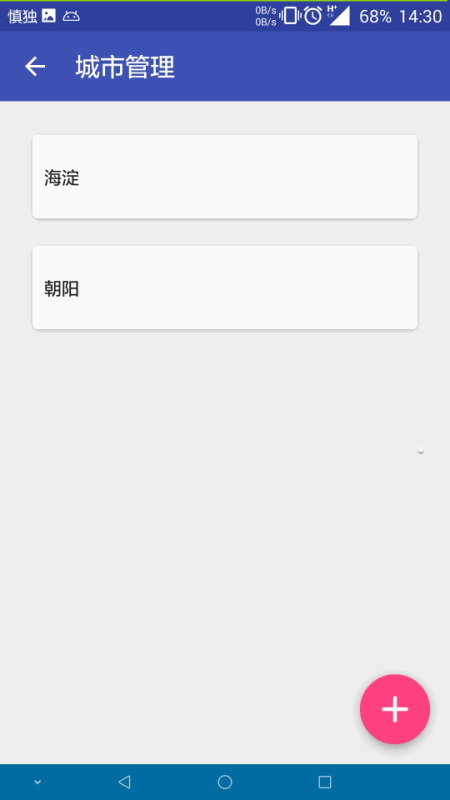

## LuWeather ##

**主要实现**

1. 城市天气展示
2. 城市选择
3. 多城市管理，滑动删除
4. 天气下拉刷新
5. 根据基站获取大致位置
6. 沉浸式状态栏

---
> 天气API： [小米天气API](http://weatherapi.market.xiaomi.com/wtr-v2/weather?cityId=CITYID) 

> 位置服务：[百度反地理编码](http://api.map.baidu.com/geocoder/v2/?ak=USERKEY&location=PONIT&output=json)

> 网上收集省市代码code

主要使用：

 - Gson
 - xUtils
 - iconFont
 - RecyclerView+CardView
 - [StatusBarUtils](https://github.com/laobie/StatusBarDemo/blob/master/app/src/main/java/com/jaeger/statusbardemo/StatusBarUtils.java)(by Jaeger)
 - hellocharts（by Leszek Wach）

---
主要使用xUtils的DB模块作为存储方式，
获取城市天气信息步骤：

1. 首先查询数据库，获取最近一次该城市的天气信息
2. 天气存在，判断更新时间是否为近5min（防止重复获取）
3. 5min内可以复用，大于该时间则通过网络请求获取天气信息
4. 成功获取天气信息，展示并存入数据库

---
截图

---
**TODO**

待完善：

1. 城市管理中拖拽排序
2. ...